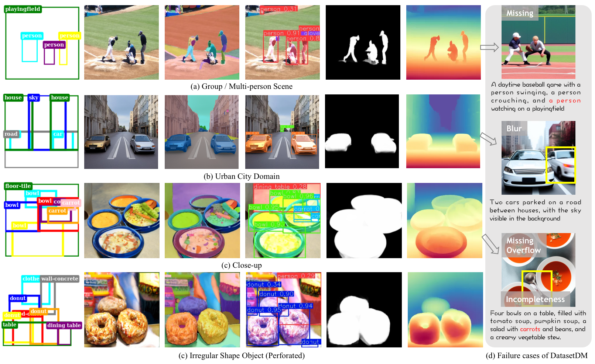

# FlexDataset
This repository contains the code and materials for our paper:  
**FlexDataset: Crafting Annotated Dataset Generation for Diverse Applications.**

 
 
 
Project Page: https://ellenyige.github.io/flexdataset/
<!--  -->
---

## Experiments

> Examples of annotated data generated from FlexDataset with various MIMC (multi-instance and multi-category) configurations. Text prompts are created from generated scene using ControlCap (Zhao et al. 2024) for a fair comparison with T2D (text-to-data) methods (e.g., DatasetDM). Red: missed classes; Yellow boxes : blurred or overflowed classes.
